# Convert Raster Images to Vector Graphics

> Sa'di Altamimi @ 2017

As part of my Wolfram Mentorship Program, I chose to work on this interesting and challenging project that combines image processing, artificial intelligence, graph theory and Wolfram Language (who can think of better combination?!). Now since part of the work is confidential and can't be shared (as it uses some of internal WL code), it's useful to mention that this post is not intended to be a full step by step tutorial but rather a conceptual overview on what we are working on. Hope you'll enjoy it and find it useful !

## Project Description

Write a function to find an approximation to images as vector graphics (effectively: "convert GIF to SVG'). Flags may be a helpful example to consider. There will be a tradeoff between "fitting' the image, and having a simple "model' in terms of vector graphics.

Category: `Algorithms`, `Artificial Intelligence`

Suggested readings:

 - http://reference.wolfram.com/language/guide/ImageProcessing.html
 - http://reference.wolfram.com/language/ref/Interpolation.html

-------

## Introduction

Two typical representations for pictures are raster images and vector graphics. Images are represented by an array of picture-elements called pixels, each has a numerical value to indicate its color. Pixel based image representation has revealed its drawbacks in many applications such as image magnification and printing. Vector graphics defines images using graphics objects like curves and surfaces, rather than discrete points of pixels. The vector representation has many interesting features; such as being scalable, compact and resolution independent.

Conversion between pixel images and vector graphics is always desired. The conversion from vectors to images in WL is straightforward using Rasterize function. However, the opposite is surprisingly not easy at all and has attracted increasing interest in recent years. The following figure illustrates some possible issues in reconstructing line edges and surface colors from an image.  

![Possible issues with ImageGraphics[] function](imgs/1.PNG)

-------

## Approach

The conversion process, in general, is divided into three stages: first of all, edge detection is performed to highlight  image outline, the result is a chain of pixels. Actually, not all those pixels are necessary to reconstruct original image. Thus, a feature extraction stage is required to keep only important pixels (edges, corners, etc.). Finally, the key points are connected together to form graphics lines & meshes, as shown below, to reconstruct image outlines & surface colors. The following figure illustrate these stages:

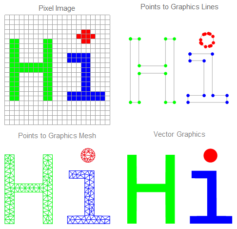

The scope of this post covers converting line drawing images to vector graphics (i.e. reconstructing shape outline only without surface color). 

## Image to graph

It is convenient to use graph object as an intermediate representation of image features, where key points represent graph nodes and image lines are graph links. Once the graph is constructed, it will be easy to replace graph links with the actual curve shape. A good starting point could be from *MorphologicalGraph* functions starting with skeleton image (e.g.  which is the result of *Binarize* and *Thinning* functions applied to the input image). Then modify graph links to have the exact shape of original image.

The process is divided into three steps:

 1. Convert image into list of vertices and links
 2. Find connection between vertices and links
 3. Find edges

**Feature Extraction (Vertices & Links)**

In the first step, we use *SkeletonEndPoints* and *SkeletonBranchPoints* as feature points. They will serve as graph's edges, which will define the shape of our vector graphics.  Each vertex is given a unique index as shown below. I tested the function on a simple image, with 3 endpoints and 1 branch point (I should have included a loop for completeness). Each node has given a unique index (I marked vertices in yellow for better visualization). One tricky situation is when we have a circle (or any isolated loop) that doesn't contain any branch. in this case, *MorphologicalTransform* will return an empty result, so we should think of something else. I found *ImageCorners* pretty useful, but it return (x,y)-coordinates instead on (row,column)-pairs. So you need to convert them first before producing an image that can be added with *ImageAdd* to the vertices. 
```WL
findVertices[skeleton_, opt : OptionsPattern[Graph]] := Module[
    {vertices, others},
        
    vertices = ImageAdd[
        MorphologicalTransform[skeleton, "SkeletonEndPoints", Padding -> 0], 
        MorphologicalTransform[skeleton, "SkeletonBranchPoints", Padding -> 0]];
        
    
    {vertices, others}
];
```
The result of this function is shown below.

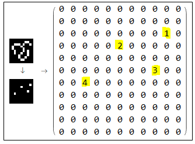

Subtracting vertices from the image produces line segments. Those are the links that will connect graph edges. They will be fed to the simplification algorithm in the next stage. Note that each link is given a unique index among links and vertices. Number of segments as well as the length of each segment is also measured.

```WL
findLinks[skeleton_, vertices_, vertexCount_] := Module[
    {dims = ImageDimensions[skeleton], linkComponents, others},
    
    linkComponents = MorphologicalComponents@ImageSubtract[skeleton, vertices];
    linkComponents = Replace[linkComponents, Except[0, n_] :> n + vertexCount, {2}];
    
    {linkComponents, others}
    ]
```

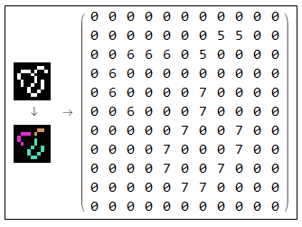

**Features to Graph (Links and Nodes)**

The second step is by far the most involving step in the whole process; finding which vertex is connected to which link. Connection can be strong (from four directions) or weak (also include diagonals). There is also some special cases like finding short connections that consist of only 2 pixels, etc.A good starting point is from *ComponentMeasurements* by measuring  *"Neighbors"* of vertices and links. To find strong connections you can set *CornerNeighbors* to *False*, while setting it to *True* yields weak connections. A sample output is shown below.

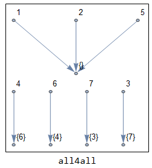 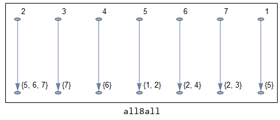

Note that point 4 and link 6 are strongly-connected. Point 2 is clearly a branch point since it is connected to three links (5,6,7). Now without further details of internal subfunctions involved in this step, I'll show the general function to give you an idea on how complex this step is.

```WL
Options[morphologicalGraphics] = Options[Graph];
morphologicalGraphics[skeleton_, opts : OptionsPattern[morphologicalGraphics]] := Module[
    {vertices, vertexComponents, linkComponents, strong4, weak8, 
        redundantEdges, directEdges, linkedEdges, loopEdges, cleanEdges, extraEdges, allEdges, allLines},
    
    {vertices, others} = findVertices[skeleton]; 
    
    {linkComponents, others} = findLinks[skeleton, vertices, others];
    
    {strong4, others} = findStrongConnections[vertexComponents, linkComponents, others];
    
    {weak8, others} =  findWeakConnections[vertexComponents, linkComponents, others];
    
    redundantEdges = findRedundantEdges[strong4, others];
    
    {directEdges, linkedEdges, loopEdges, cleanEdges} =  findEdges[weak8,redundantEdges, others];
    
    {extraEdges, others} = findExtraEdges[strong4, linkComponents, weak8, others];
    
    (* convert all edges into list of points *)
    allLines = Join[
            Replace[List @@@ directEdges, Dispatch@vertexCoordinates, {2}],
            Replace[Join[List @@@ cleanEdges, List @@@ extraEdges],   Dispatch@Join[vertexCoordinates, linkPositions], {2}]
        ]
    ];
```

The final output of the graph is converted to a list of coordinates defining the lines in the original image. Those points are not necessarily listed in the correct order. Furthermore, not all the points are needed to reproduce the lines segment. This allows more room for line simplification process (next stage) which result in smoother vector graphics, as well as smaller file size.

The following code is to test *morphologicalGraphics* function we show above.

```WL
Framed@Module[{x},
    x = morphologicalGraphics[skeleton];
    Image[skeleton, ImageSize -> Small] ->

    Graphics[{Line[x], Red, PointSize[0.03], Point /@ x, Blue,
        Point[Join[First /@ x, Last /@ x]]},
        PlotLabel -> "Blue edges are correct, \nred points are not in the correct order", ImageSize -> 250]
    ]
```

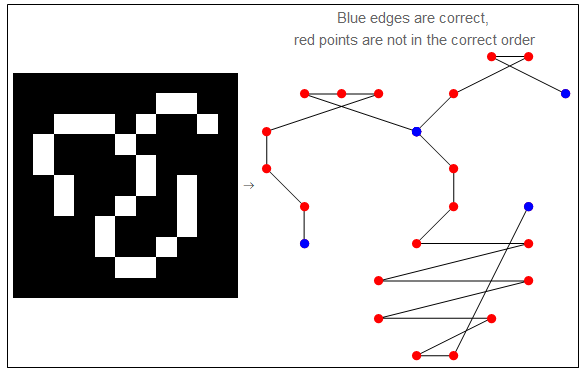

----------

## Line Simplification

Douglas-Peucker algorithm is used to simplify curves and lines connecting graph edges (called polylines). Simplification in this context refers to reducing the number of points needed to draw a polyline while maintaining its basic shape. The algorithm assumes points connecting two edges to be in right order (this step is done in *pointsToPath* function). This process is divided into two steps:

 1. Rearrange list of points
 2. Simplify line segments

**Rearrange points as Path**

In the first step, we'll benefits from the intermediate representation we have. Since we convert raster image into a graph of nodes and links, we can use graph theory to rearrange list of points we have by creating a *DelaunayMesh* then trace the shortest path from the start to the end using *FindHamiltonianPath*.

Two special cases are there: 1) when a starting point meets the end point we have a loop and FindHamiltonianPath fails to find shortest path. One possible solution is by using *FindHamiltonianCycle*. 2) if by any chance we had all points aligned in a straight line, *DelaunayMesh* produces an empty region (since points are aligned in 1D). In this case we simply use *Sort* on the points we have. The following code illustrates this step.

```WL
pointsToPath[points2_List] := Module[
    {a, b, points, Region, edges, graph, path},
    points = points2;
    
    (* Loop detection :TODO:need enhancement using FindHamiltonianCycle *)
    If[points[[1]] == points[[-1]],
        points = Drop[points, -1];
        {a, b} = TakeDrop[points, {Position[points, Last@Nearest[points, points[[1]], 2]][[1, 1]]}];
        points = Join[b, a];
    ];
    
    (* Create a Delaunay mesh *)
    Region = DelaunayMesh[points];
    If[Region === EmptyRegion[2], Return[Sort@points]];
    
    (* Mesh to graph *)
    edges = Map[Sort, MeshCells[Region, 1][[All, 1]]];
    graph = Graph[Range[Max@edges], Apply[UndirectedEdge, edges, {1}],
                        EdgeWeight -> Map[EuclideanDistance @@ points[[#]] &, edges]];
    
    path = FindHamiltonianPath[graph, 1, Length[points]];
    Part[points, path]
    ]
```

And here is the result.

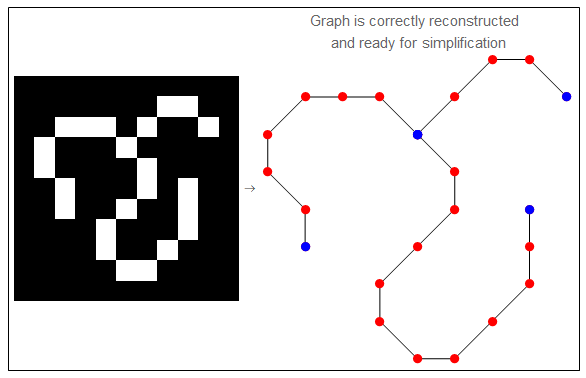

**Simplification Step.**

Once the points are in the correct order, we can apply Douglas-Peucker algorithm. Refer to the previous figure, the algorithm will not change blue points (edges), it will simplify red points (segment points) to reconstruct curves that connect blue points with minimum number of red points. The process works as follow:

First, Connect two edges (p1, p2) with line segment and measure distance between all intermediate points (qi) and this line.

```WL
pointLineDistance[q_, {p1_, p2_}] := With[
    {eqn = (q - p1).(p2 - p1) / (p2 - p1).(p2 - p1)}, 
    Which[
        eqn <= 0 , Norm[q - p1],
        eqn >= 1 , Norm[q - p2],
        True     , Norm[q - (p1 + eqn (p2 - p1))]
    ]
    ];
```

Then, if the distance to the furthest point is greater than threshold (smoothness factor), pick it as a new edge and split line into two segments. Otherwise, the segmentation process is done and all other intermediate points can be eliminated.

```WL
lineSplit[segment[points_List], threshold_] := Module[
    {dists, dmax = 0, pos},
    dists = Map[pointLineDistance[#, {points[[1]], points[[-1]]}] &,   points[[2 ;; -2]]]; 
    dmax = Max[dists];
    
    If[dmax > threshold,
        pos = Position[dists, dmax][[1, 1]] + 1;
        {segment[points[[1 ;; pos]]], segment[points[[pos ;;]]]},
    
        segment[points, done]
    ]
] /; Length[points] > 2

lineSplit[segment[points_List], threshold_] := segment[points, done];

lineSplit[segment[points_List, done], threshold_] := segment[points, done];
```

Finally, recursively apply segmentation process using *ReplaceRepeated* until all segments are marked *done*. Note that I used `First/@First/@ ...` to access data points in the structure `segment[{points,_}, _]` which is used by `lineSplit` function.

```WL
simplifyPolyline[points_List, threshold_] :=
    Append[First /@ First /@ Flatten[
        ReplaceRepeated[{segment[points]},
        s_segment :> lineSplit[s, threshold]]
        ], Last[points]
];
```

A simple example illustrates the simplification process is shown bellow. For better approximating curvy shapes, line segments can be used as supporting lines for *BSpline* curves.

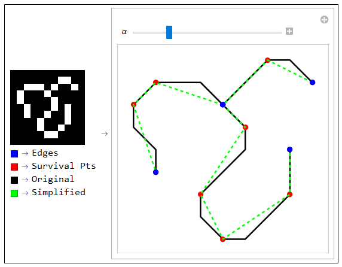

----------

## SketchGraphics Function

Finally, we are ready to rap everything up in a nice and compact function. As we described in the far beginning, the function accepts a raster line drawing image (skeleton) and produces a vector graphics after converting image into graph then simplify links between nodes.

```WL
sketchGraphics[skeleton_Image, polyline_, smoothness_, 
    opts : OptionsPattern[Graph]] := Module[
    {allLines, allPaths},
    allLines = morphologicalGraphics[skeleton];
    
    allPaths = Map[ simplifyPolyline[#, smoothness] &,
                        pointsToPath[#] & /@ allLines];
    Graphics[polyline /@ allPaths, Sequence @@ Flatten@{opts}]
    ];
```

And here we are. Left: input, Right: output.

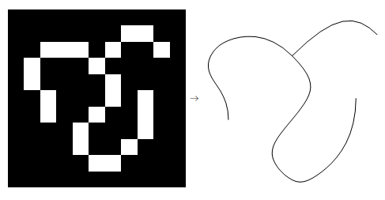


----------

## More Tests

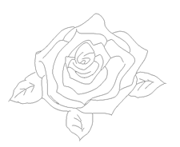   ==  

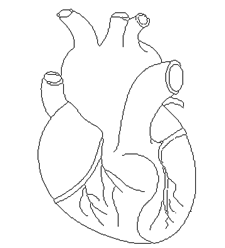  ==  

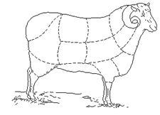  ==  

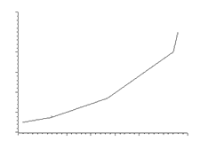  ==  

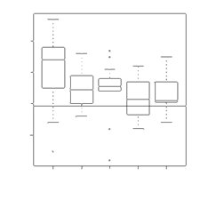  ==  

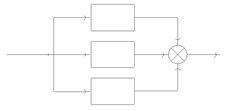  ==  

----------

## Technical Notes

**A. Using ImageCorners**:

I mentioned that using this function can help solving loop problem when no branch or endpoint is found. However, some processing is needed before you can add it to vertices image. *ImageCorners* processes list of graphics coordinates (x,y), so you'll need to convert it to matrix coordinates (row, column) then to binary image. The following code is one way to do that (I guess there should be a better way to get rid of the *For-loop*):

```WL
vertices = Transpose@ConstantArray[0, ImageDimensions[skeleton]];
height = Last@ImageDimensions[skeleton];
        
vertexCoordinates = ImageCorners[skeleton, 1, 0.001, 2];
{row, col} = IntegerPart@Apply[{height - (#2 - .5), #1 + .5} &, vertexCoordinates, {1}] // Transpose;

For[i = 1, i <= Length[vertexCoordinates], i++,
    vertices[[ row[[i]], col[[i]] ]] = 1;
];

Image[vertices]
```

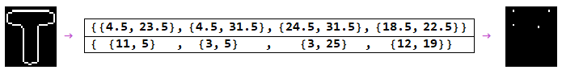

**B. More details on *pointsToPath* function**

In the simplification step, we are required to make sure that points in a line segment are in the correct order so that we can use Douglas-Peucker algorithm. This step involves two operations: constructing a Delaunay mesh and then Finding the Hamiltonian path. the following three figures shows (from left to right) list of points, distorted graphics object, sorted point on the mesh.

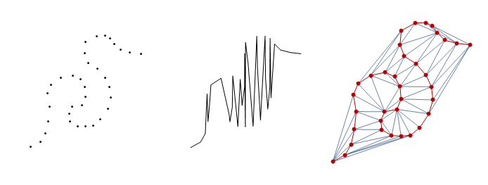

**C. From Image to Graphics:**

In case you'd like to see how I created the following illustration, here is the code from `Electromagnetics` Package


```WL
<< NDSolve`FEM`;
img[size_] := ColorNegate@Binarize@Rasterize[Style["Hi", size]];

{{
ArrayPlot[
pimg = ReplacePart[
    MorphologicalComponents[img[20]], {5, 19} -> 1], Mesh -> All, 
ImageSize -> Small, PlotLabel -> "Pixel Image", 
ColorRules -> {0 -> White, 1 -> Red, 2 -> Green, 3 -> Blue}],

cimg = ImageCorners[img[700], 0.5];
HighlightImage[ColorNegate@Thinning[EdgeDetect@img[700]],
{PointSize[0.03], Green, 
    Point /@ cimg[[{1, 2, 13, 14, 3, 4, 20, 19, 9, 8, 18, 17, 1}]],
    Blue, cimg[[{5, 6, 16, 11, 22, 21, 10, 15, 7, 12, 5}]],
    Red, cimg[[23 ;; -1 ;; 3]]},
ImageSize -> Small, PlotLabel -> "Points to Graphics Lines"],

}, {

toMesh[poly_, color_] := 
MeshRegion[
    ToElementMesh[poly, MaxCellMeasure -> 570, AccuracyGoal -> .125],
    MeshCellStyle -> {{1, All} -> color}, PlotTheme -> "Lines"];
Labeled[Show[{
    toMesh[
    Polygon@cimg[[{1, 2, 13, 14, 3, 4, 20, 19, 9, 8, 18, 17, 1}]], 
    Green],
    toMesh[Polygon@cimg[[{5, 6, 16, 11, 22, 21, 10, 15, 7, 12, 5}]],
    Blue],
    toMesh[Disk[Mean /@ Transpose@cimg[[23 ;;]], 45], Red]}
    ], "Points to Graphics Mesh", Top, FrameMargins -> 5, 
LabelStyle -> 
    Directive[GrayLevel[.5], FontSize -> 12, 
    FontFamily -> "Helvetica"]],

Labeled[
gimg = Graphics[{Green, 
    Polygon@cimg[[{1, 2, 13, 14, 3, 4, 20, 19, 9, 8, 18, 17, 1}]],
    Blue, Polygon@cimg[[{5, 6, 16, 11, 22, 21, 10, 15, 7, 12, 5}]],
    Red, Disk[Mean /@ Transpose@cimg[[23 ;;]], 45]}],
"Vector Graphics", Top, FrameMargins -> 7, 
LabelStyle -> 
    Directive[GrayLevel[.5], FontSize -> 12, 
    FontFamily -> "Helvetica"]]

}} // Grid
```  

----------

## Acknowledgment

At the end of this post, I'd like to thanks Wolfram Research for allowing this amazing opportunity, and special thanks to my mentors Markus van Almsick and Todd Rowland. And I guess it would be nice to finish this post with this piece of code. This time I converted the whole code into Wolfram Package :)

```WL
SetDirectory[NotebookDirectory[]];
Needs["sketchGraphics`"];

skeleton = Thinning@Binarize@EdgeDetect@Rasterize@Style["Thanks          Markus         !", 
            FontSize -> 40, FontFamily -> "Bold Italic Art"];

sketchGraphics[skeleton, BSplineCurve, 0.2];
```

And here is the result !


**References:**

 - Mark McClure, "Polyline Simplification", http://demonstrations.wolfram.com/PolylineSimplification/


  [1]: http://community.wolfram.com//c/portal/getImageAttachment?filename=1.PNG&userId=884569
  [2]: http://community.wolfram.com//c/portal/getImageAttachment?filename=2.PNG&userId=884569
  [3]: http://community.wolfram.com//c/portal/getImageAttachment?filename=3.png&userId=884569
  [4]: http://community.wolfram.com//c/portal/getImageAttachment?filename=4.PNG&userId=884569
  [5]: http://community.wolfram.com//c/portal/getImageAttachment?filename=6.PNG&userId=884569
  [6]: http://community.wolfram.com//c/portal/getImageAttachment?filename=7.PNG&userId=884569
  [7]: http://community.wolfram.com//c/portal/getImageAttachment?filename=8.PNG&userId=884569
  [8]: http://community.wolfram.com//c/portal/getImageAttachment?filename=9.PNG&userId=884569
  [9]: http://community.wolfram.com//c/portal/getImageAttachment?filename=10.PNG&userId=884569
  [10]: http://community.wolfram.com//c/portal/getImageAttachment?filename=11.PNG&userId=884569
  [11]: http://community.wolfram.com//c/portal/getImageAttachment?filename=12.PNG&userId=884569
  [12]: http://community.wolfram.com//c/portal/getImageAttachment?filename=13.png&userId=884569
  [13]: http://community.wolfram.com//c/portal/getImageAttachment?filename=14.svg&userId=884569
  [14]: http://community.wolfram.com//c/portal/getImageAttachment?filename=15.png&userId=884569
  [15]: http://community.wolfram.com//c/portal/getImageAttachment?filename=15.svg&userId=884569
  [16]: http://community.wolfram.com//c/portal/getImageAttachment?filename=16.png&userId=884569
  [17]: http://community.wolfram.com//c/portal/getImageAttachment?filename=16.svg&userId=884569
  [18]: http://community.wolfram.com//c/portal/getImageAttachment?filename=17.png&userId=884569
  [19]: http://community.wolfram.com//c/portal/getImageAttachment?filename=17.svg&userId=884569
  [20]: http://community.wolfram.com//c/portal/getImageAttachment?filename=18.png&userId=884569
  [21]: http://community.wolfram.com//c/portal/getImageAttachment?filename=18.svg&userId=884569
  [22]: http://community.wolfram.com//c/portal/getImageAttachment?filename=19.png&userId=884569
  [23]: http://community.wolfram.com//c/portal/getImageAttachment?filename=19.svg&userId=884569
  [24]: http://community.wolfram.com//c/portal/getImageAttachment?filename=98495.PNG&userId=884569
  [25]: http://community.wolfram.com//c/portal/getImageAttachment?filename=20.PNG&userId=884569
  [26]: http://community.wolfram.com//c/portal/getImageAttachment?filename=2.PNG&userId=884569
  [27]: http://community.wolfram.com//c/portal/getImageAttachment?filename=20.svg&userId=884569
